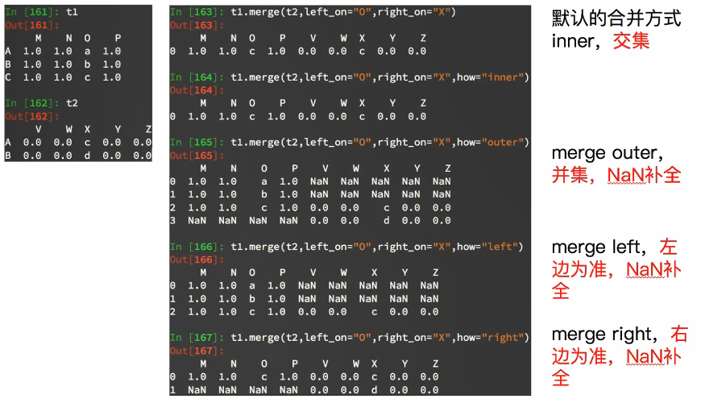

# Pandas
    pandas is an open source, BSD-licensed library providing high-performance, easy-to-use data structures and data analysis tools for the Python programming language.
## Pandas 数据类型
    Series 一维，带标签数组
    DataFrame 二维，Series容器
## Series
    类似于一维数组的对象，由一组数据和一组与之相关的标签(索引)组成
### 创建Series
```python
import pandas as pd
# 创建Series
t = pd.Series([1, 2, 3, 4, 5])

# 根据字典创建Series，key为索引，value为值
t1 = pd.Series({'name': 'xiaojie', 'age': 18, 'tel': 10086})

# 创建Series指定索引
t2 = pd.Series([1, 2, 3, 4, 5], index=['a', 'b', 'c', 'd', 'e'])
t2.astype(float) # 修改Series数据类型

t.index # 取出来所有标签（索引）， 属于可迭代对象
t.values # Series的所有值，  属于可迭代对象
```
### Series切片和索引
```python
import pandas as pd
t2 = pd.Series([1, 2, 3, 4, 5], index=['a', 'b', 'c', 'd', 'e'])

# 根据索引取值
t2['a']
# 取指定行的值
t2[2]
# 取指定行之间的数据
t2[2:3]
# 根据索引取多行的值
t2[['a', 'e']]
# 根据行号取指定值
t2[[0,4]]

# 取所有的索引
for i in t2.index:
    print(i)

# 取所有的值
for i in t2.values:
    print(i)

```


## DataFrame
    DataFrame是Series容器， 既有行索引，还有列索引

>- DataFrame对象既有行索引，又有列索引
>>- 行索引，表明不同行，横向索引，叫index，0轴，axis=0
>>>- 列索引，表名不同列，纵向索引，叫columns，1轴，axis=1
### 创建DataFrame
    pandas.DateFrame(data=None, index=None, columns=None, dtype=None, copy=False)
```python
import pandas as pd
import numpy as np

# -----------------------------------------------------------------------------------------------------------------------
# -----------------------------------------------------------------------------------------------------------------------

a = pd.DataFrame(np.arange(12).reshape(3, 4), index=list('abc'), columns=[10, 20, 30, 40])
print(a)
'''
   10  20  30  40
a   0   1   2   3
b   4   5   6   7
c   8   9  10  11
'''
# -----------------------------------------------------------------------------------------------------------------------
# -----------------------------------------------------------------------------------------------------------------------

b = pd.DataFrame({'name': ['zhangsan', 'lisi'], 'age': [12, 18], 'tel': [10086, 10010]})
print(b)
'''
# 字典的建做列索引
       name  age    tel
0  zhangsan   12  10086
1      lisi   18  10010
'''
# -----------------------------------------------------------------------------------------------------------------------
# -----------------------------------------------------------------------------------------------------------------------
c = pd.DataFrame(
    [{'name': 'zhangsan', 'age': 12, 'tel': 10010}, {'name': 'lisi', 'age': 13, 'tel': 10086}, {'name': 'xiaojie'}])
print(c)
'''
# 自动提取每个字典的键，做列索引
    age      name      tel
0  12.0  zhangsan  10010.0
1  13.0      lisi  10086.0
2   NaN   xiaojie      NaN

'''
```
### DataFrame基础属性

### DtaFrame 索引取值
#### 通过切割进行索引
```python
import pandas as pd

df = pd.DataFrame(
    [{'name': 'zhangsan', 'age': 12, 'tel': 10010}, 
    {'name': 'lisi', 'age': 13, 'tel': 10086}, 
    {'name': 'xiaojie'},
    {'name': 'mayun', 'age': '66', 'tel': 110}])

df[:2]  # 取前两行
df[:2]['age']  # 取前两行的指定列数据
df['age']  # 取指定列的数据
```
#### loc 通过标签进行索引数据
```python
import pandas as pd

df = pd.DataFrame(
    [{'name': 'zhangsan', 'age': 12, 'tel': 10010}, 
    {'name': 'lisi', 'age': 13, 'tel': 10086}, 
    {'name': 'xiaojie'},
    {'name': 'mayun', 'age': '66', 'tel': 110}])
df.loc[[1, 2], ['age', 'tel']] # 取指定行指定列的数据（第1，2行的age，和tel列）
df.loc[1, 'age']  # 取指定行和指定列交叉的数据
df.loc[1, ['age', 'name']]  # 取指定行，的指定的多列的数据
df.loc[1:2, ['age']]  # 取1-2行的age列
```
#### iloc 通过位置进行索引数据
```python
import pandas as pd

df = pd.DataFrame(
    [{'name': 'zhangsan', 'age': 12, 'tel': 10010}, 
    {'name': 'lisi', 'age': 13, 'tel': 10086}, 
    {'name': 'xiaojie'},
    {'name': 'mayun', 'age': '66', 'tel': 110}])
    
# iloc 通过位置进行索引数据
df.iloc[1:3,[2,3]]
df[1:3, 1:3]
```

#### DateFrame 布尔值索引
```python
import pandas as pd

df = pd.DataFrame({'name': ['xiaojie', 'zhangsan', 'lisi', 'wangwu'], 'age': [18, 28, 38, 48]})
print(df[(df['age'] < 30) & (df['age'] > 20)]) # 取年龄小于30大于20的人
print(df[(df['age'] == 18) | (df['age'] == 28)]) # 取年龄等于18或者28的人

```

####  排序
```python
import pandas as pd

df = pd.DataFrame(
    [{'name': 'zhangsan', 'age': 12, 'tel': 10010}, 
    {'name': 'lisi', 'age': 13, 'tel': 10086}, 
    {'name': 'xiaojie'},
    {'name': 'mayun', 'age': 66, 'tel': 110}])
    
# 排序
print(df[:2].sort_index())  # 按列索引进行排序
print(df.sort_values('name'))  # 按指定列进行排序  
```
## 缺失值处理
判断数据是否为NaN：pd.isnull(df),pd.notnull(df)

处理方式1：删除NaN所在的行列dropna (axis=0, how='any', inplace=False)
处理方式2：填充数据，t.fillna(t.mean()),t.fiallna(t.median()),t.fillna(0)


处理为0的数据：t[t==0]=np.nan
当然并不是每次为0的数据都需要处理
计算平均值等情况，nan是不参与计算的，但是0会
## DateFrame数据合并
>- join: 根据列索引合并, 会根据第一个FateFrame的列索引进行合并， 如果第二个
```python

import pandas as pd
import numpy as np

t1 = pd.DataFrame(np.zeros((3, 4)), index=[0, 1, 2], columns=[0, 1, 2, 3])
print(t1)
'''
     0    1    2    3
0  0.0  0.0  0.0  0.0
1  0.0  0.0  0.0  0.0
2  0.0  0.0  0.0  0.0
'''


t2 = pd.DataFrame(np.zeros((2, 2)), index=[0, 1], columns=['a', 'b'])
'''
     a    b
0  0.0  0.0
1  0.0  0.0
'''
# 会根据t1的所有行索引进行合并， t2多出的行会删掉， 缺失的行会补上nan
t1.join(t2)
'''
     0    1    2    3    a    b
0  0.0  0.0  0.0  0.0  0.0  0.0
1  0.0  0.0  0.0  0.0  0.0  0.0
2  0.0  0.0  0.0  0.0  NaN  NaN
'''

t2.join(t1)
'''
     a    b    0    1    2    3
0  0.0  0.0  0.0  0.0  0.0  0.0
1  0.0  0.0  0.0  0.0  0.0  0.0
'''
```
>- marge合并


# 实例1
```python
'''
需求分析：
>- 有一组电影数据
RangeIndex: 1000 entries, 0 to 999
Data columns (total 12 columns):
Rank                  1000 non-null int64
Title                 1000 non-null object
Genre                 1000 non-null object
Description           1000 non-null object
Director              1000 non-null object
Actors                1000 non-null object
Year                  1000 non-null int64
Runtime (Minutes)     1000 non-null int64
Rating                1000 non-null float64
Votes                 1000 non-null int64
Revenue (Millions)    872 non-null float64
Metascore             936 non-null float64
dtypes: float64(3), int64(4), object(5)
memory usage: 93.8+ KB
None

需要统计的信息：
1. 导演人数
    len(df['Director'].unique())
2. 演员人数
    len(set([i for j in df['Actors'].str.split(', ').tolist() for i in j]))
3. 时长最长的电影
    df[df['Runtime (Minutes)'] == df['Runtime (Minutes)'].max()]['Title'].values.
4. 统计电影的各个分类的数量
    # 获取所有的分类
    genre_all = set([j for i in df['Genre'].str.split(',').tolist() for j in i])

    # 根据分类创建一个 列所以为分类， 行索引为电影的个数，的全0的DataFrame
    genre_df = pd.DataFrame(np.zeros((df.shape[0], len(genre_all))), columns=list(genre_all))

    # 循环每个电影，并获取电影的分类，在对应的新分类DateFeame中标1
    for index in range(0, df.shape[0]):
        genre_df.loc[index, df['Genre'].str.split(',')[index]] = 1

    for genre in genre_all:
        print('分类:', genre, '个数:', genre_df[genre].sum())

'''
import pandas as pd
import numpy as np
file = 'IMDB-Movie-Data.csv'

df = pd.read_csv(file)


print('导演人数:', len(df['Director'].unique()))

print('演员人数:', len(set([i for j in df['Actors'].str.split(', ').tolist() for i in j])))

print('时长最长的电影:', df.loc[df['Runtime (Minutes)'].idxmax(), 'Title'])

# 获取所有的分类
genre_all = set([j for i in df['Genre'].str.split(',').tolist() for j in i])

# 根据分类创建一个 列所以为分类， 行索引为电影的个数，的全0的DataFrame
genre_df = pd.DataFrame(np.zeros((df.shape[0], len(genre_all))), columns=list(genre_all))

# 循环每个电影，并获取电影的分类，在对应的新分类DateFeame中标1
for index in range(0, df.shape[0]):
    genre_df.loc[index, df['Genre'].str.split(',')[index]] = 1

for genre in genre_all:
    print('分类:', genre, '个数:', genre_df[genre].sum())

```
