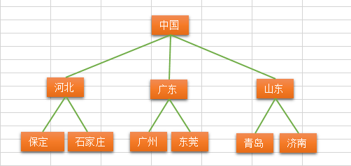
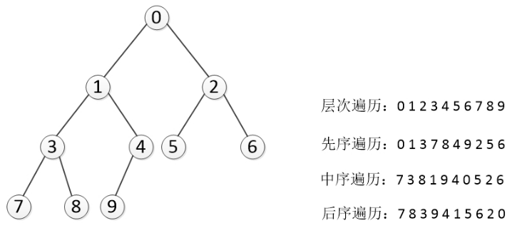

# 树的概念
    树（英语：tree）是一种抽象数据类型（ADT）或是实作这种抽象数据类型的数据结构，用来模拟具有树状结构性质的数据集合。
    它是由n（n>=1）个有限节点组成一个具有层次关系的集合。
    把它叫做“树”是因为它看起来像一棵倒挂的树，也就是说它是根朝上，而叶朝下的。
>- 具有以下的特点：

>>- 每个节点有零个或多个子节点；
>>- 没有父节点的节点称为根节点；
>>- 每一个非根节点有且只有一个父节点；
>>- 除了根节点外，每个子节点可以分为多个不相交的子树；

# 树的术语

- 节点的度：一个节点含有的子树的个数称为该节点的度；
- 树的度：一棵树中，最大的节点的度称为树的度；
- 叶节点或终端节点：度为零的节点；
- 父亲节点或父节点：若一个节点含有子节点，则这个节点称为其子节点的父节点；
- 孩子节点或子节点：一个节点含有的子树的根节点称为该节点的子节点；
- 兄弟节点：具有相同父节点的节点互称为兄弟节点；
- 节点的层次：从根开始定义起，根为第1层，根的子节点为第2层，以此类推；
- 树的高度或深度：树中节点的最大层次；
- 堂兄弟节点：父节点在同一层的节点互为堂兄弟；
- 节点的祖先：从根到该节点所经分支上的所有节点；
- 子孙：以某节点为根的子树中任一节点都称为该节点的子孙。
- 森林：由m（m>=0）棵互不相交的树的集合称为森林；

# 树的种类

>- 无序树：树中任意节点的子节点之间没有顺序关系，这种树称为无序树，也称为自由树；
>- 有序树：树中任意节点的子节点之间有顺序关系，这种树称为有序树；
>>- 二叉树：每个节点最多含有两个子树的树称为二叉树；
>>>- 完全二叉树：对于一颗二叉树，假设其深度为d(d>1)。除了第d层外，其它各层的节点数目均已达最大值，且第d层所有节点从左向右连续地紧密排列，这样的二叉树被称为完全二叉树，其中满二叉树的定义是所有叶节点都在最底层的完全二叉树;
>>>- 平衡二叉树（AVL树）：当且仅当任何节点的两棵子树的高度差不大于1的二叉树；
>>>- 排序二叉树（二叉查找树（英语：Binary Search Tree），也称二叉搜索树、有序二叉树）；
>>- 霍夫曼树（用于信息编码）：带权路径最短的二叉树称为哈夫曼树或最优二叉树；
>>- B树：一种对读写操作进行优化的自平衡的二叉查找树，能够保持数据有序，拥有多余两个子树。

# 二叉树的基本概念
    二叉树是每个节点最多有两个子树的树结构。通常子树被称作“左子树”（left subtree）和“右子树”（right subtree）

## 二叉树的性质(特性)

- 性质1: 在二叉树的第i层上至多有2^(i-1)个结点（i>0）
- 性质2: 深度为k的二叉树至多有2^k - 1个结点（k>0）
- 性质3: 对于任意一棵二叉树，如果其叶结点数为N0，而度数为2的结点总数为N2，则N0=N2+1;
- 性质4:具有n个结点的完全二叉树的深度必为 log2(n+1)
- 性质5:对完全二叉树，若从上至下、从左至右编号，则编号为i 的结点，其左孩子编号必为2i，其右孩子编号必为2i＋1；其双亲的编号必为i/2（i＝1 时为根,除外）

## 二叉树基本代码实现
```python
class Node(object):
    def __init__(self, item):
        self.item = item
        self.lchild = None
        self.rchild = None


class Tree(object):
    def __init__(self):
        self.root = None

    def add(self, item):
        node = Node(item)
        if self.root is None:
            self.root = node
            return item
        queue = [self.root]
        while queue:
            temp_node = queue.pop(0)
            if temp_node.lchild is None:
                temp_node.lchild = node
                return item
            elif temp_node.rchild is None:
                temp_node.rchild = node
                return item
            else:
                queue.append(temp_node.lchild)
                queue.append(temp_node.rchild)

```

## 二叉树的遍历
    树的遍历是树的一种重要的运算。
    所谓遍历是指对树中所有结点的信息的访问，即依次对树中每个结点访问一次且仅访问一次，我们把这种对所有节点的访问称为遍历（traversal）。
>- 两种重要的遍历模式是深度优先遍历和广度优先遍历,深度优先一般用递归，广度优先一般用队列。一般情况下能用递归实现的算法大部分也能用堆栈来实现
### 深度优先遍历
    对于一颗二叉树，深度优先搜索(Depth First Search)是沿着树的深度遍历树的节点，尽可能深的搜索树的分支。
那么深度遍历有重要的三种方法。这三种方式常被用于访问树的节点，它们之间的不同在于访问每个节点的次序不同。这三种遍历分别叫做先序遍历（preorder），中序遍历（inorder）和后序遍历（postorder）。
#### 深度优先遍历-先序遍历
    先序遍历 在先序遍历中，我们先访问根节点，然后递归使用先序遍历访问左子树，再递归使用先序遍历访问右子树
- 根节点->左子树->右子树
```
def preorder(self, root):
      """递归实现先序遍历"""
      if root == None:
          return
      print root.elem
      self.preorder(root.lchild)
      self.preorder(root.rchild)
```
####  深度优先遍历-中序遍历
- 左子树->根节点->右子树
```
def inorder(self, root):
      """递归实现中序遍历"""
      if root == None:
          return
      self.inorder(root.lchild)
      print root.elem
      self.inorder(root.rchild)
```

#### 深度优先遍历-后序遍历
    后序遍历 在后序遍历中，我们先递归使用后序遍历访问左子树和右子树，最后访问根节点
- 左子树->右子树->根节点
```
def postorder(self, root):
      """递归实现后续遍历"""
      if root == None:
          return
      self.postorder(root.lchild)
      self.postorder(root.rchild)
      print root.elem
```
### 广度优先遍历
    从树的root开始，从上到下从从左到右遍历整个树的节点
```
def breadth_travel(self, root):
        """利用队列实现树的层次遍历"""
        if root == None:
            return
        queue = []
        queue.append(root)
        while queue:
            node = queue.pop(0)
            print node.elem,
            if node.lchild != None:
                queue.append(node.lchild)
            if node.rchild != None:
                queue.append(node.rchild)
```



# 逆向推算树
。。。