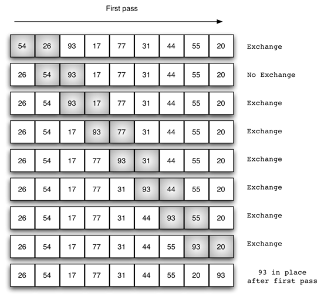

# 排序算法
    排序算法（英语：Sorting algorithm）是一种能将一串数据依照特定顺序进行排列的一种算法。
## 排序算法的稳定性

>- *稳定性*：稳定排序算法会让原本有相等键值的纪录维持相对次序。也就是如果一个排序算法是稳定的，当有两个相等键值的纪录R和S，且在原本的列表中R出现在S之前，在排序过的列表中R也将会是在S之前。
>- 不稳定排序算法可能会在相等的键值中改变纪录的相对次序，但是稳定排序算法从来不会如此。不稳定排序算法可以被特别地实现为稳定。作这件事情的一个方式是人工扩充键值的比较，如此在其他方面相同键值的两个对象间之比较，（比如上面的比较中加入第二个标准：第二个键值的大小）就会被决定使用在原先数据次序中的条目，当作一个同分决赛。然而，要记住这种次序通常牵涉到额外的空间负担。
# 冒泡排序
    冒泡排序（英语：Bubble Sort）是一种简单的排序算法。它重复地遍历要排序的数列，一次比较两个元素，如果他们的顺序错误就把他们交换过来。遍历数列的工作是重复地进行直到没有再需要交换，也就是说该数列已经排序完成。这个算法的名字由来是因为越小的元素会经由交换慢慢“浮”到数列的顶端。
## 冒泡排序算法的运作如下：
1. 比较相邻的元素。如果第一个比第二个大（升序），就交换他们两个。
2. 对每一对相邻元素作同样的工作，从开始第一对到结尾的最后一对。这步做完后，最后的元素会是最大的数。
3. 针对所有的元素重复以上的步骤，除了最后一个。
4. 持续每次对越来越少的元素重复上面的步骤，直到没有任何一对数字需要比较。
## 原理分析
>- 交换过程（第一次）

## 代码实现
```python
def bubble_sort(sequence):
    # 外层循环控制序列总共需要扫描次数，因为最后一个是不用在循环的所有（所有序列个数-2），每一次循环都能筛选出一个最大的数
    for i in range(0, len(sequence)-1):
        # 内层循环控制未排序好的元素从0到为排序好的元素最后一个角标
        for j in range(0, len(sequence)-1-i):
            # 如果当前角标元素大于后一个则替换
            if sequence[j] > sequence[j+1]:
                sequence[j], sequence[j+1] = sequence[j+1], sequence[j]
    return sequence
```
## 冒泡排序时间复杂度
- 最优时间复杂度：O(n) （表示遍历一次发现没有任何可以交换的元素，排序结束。）
- 最坏时间复杂度：O(n2)
- 稳定性：稳定

# 选择排序
    选择排序（Selection sort）是一种简单直观的排序算法。
    它的工作原理如下。首先在未排序序列中找到最小（大）元素，存放到排序序列的起始位置，
    然后，再从剩余未排序元素中继续寻找最小（大）元素，然后放到已排序序列的末尾
    。以此类推，直到所有元素均排序完毕。
## 原理分析

## 代码实现
```python
def select_sort(arry):
    # 外层循环控制序列扫描次数， 0 角标 到 倒数第二个角标
    for i in range(0, len(arry)-1):
        # 记录最小元素角标
        min_index = i
        # 内层循环控制从外层循环后一个角标开始，到序列的结尾
        for j in range(i+1, len(arry)):
            # 如果当前角标元素大于min_index记录的角标元素则 min_index重新赋值为当前角标
            if arry[min_index] > arry[j]:
                min_index = j
        # 内层循环完毕会筛选出来当前为排序的序列中最小元素角标，让后跟外层循环的当前角标元素替换
        if min_index != i:
            arry[i], arry[min_index] = arry[min_index], arry[i]
    return arry
```
## 选择排序时间复杂度
- 最优时间复杂度：O(n2)
- 最坏时间复杂度：O(n2)
- 稳定性：不稳定（考虑升序每次选择最大的情况）

# 插入排序
    插入排序（英语：Insertion Sort）是一种简单直观的排序算法。
    工作原理是通过构建有序序列，对于未排序数据，在已排序序列中从后向前扫描，找到相应位置并插入。插入排序在实现上，在从后向前扫描过程中，需要反复把已排序元素逐步向后挪位，为最新元素提供插入空间。
## 原理分析

## 代码实现
```python
def insert_sort(arry):
    # 外层循环从角标1开始到最后一个角标
    for i in range(1, len(arry)):
        # 内层循环从外层循环的当前位置的角标开始，依次递减至0角标
        for j in range(i, 0, -1):
            # 如果当前角标元素小于前一个角标元素则替换位置
            if arry[j] < arry[j - 1]:
                arry[j], arry[j - 1] = arry[j - 1], arry[j]
            # 插入排序优化，当前角标元素不小于前一个角标的时候说明，前边都是排列好的序列
            else:
                break
    return arry
```
## 插入排序时间复杂度
- 最优时间复杂度：O(n) （升序排列，序列已经处于升序状态）
- 最坏时间复杂度：O(n2)
- 稳定性：稳定
- 插入排序演示
# 希尔排序
    希尔排序(Shell Sort)是插入排序的一种。也称缩小增量排序，
    是直接插入排序算法的一种更高效的改进版本。
    希尔排序是非稳定排序算法。
    该方法因DL．Shell于1959年提出而得名。 
    希尔排序是把记录按下标的一定增量分组，对每组使用直接插入排序算法排序；
    随着增量逐渐减少，每组包含的关键词越来越多，当增量减至1时，
    整个文件恰被分成一组，算法便终止。
## 原理分析
    希尔排序的基本思想是：将数组列在一个表中并对列分别进行插入排序，重复这过程，
    不过每次用更长的列（步长更长了，列数更少了）来进行。
    最后整个表就只有一列了。将数组转换至表是为了更好地理解这算法，
    算法本身还是使用数组进行排序。
 
 ## 代码实现
 ```python
def shell_sort(arry):
    # 步长，思想上根据步长吧序列拆成多个序列
    garp = len(arry) // 2
    # 步长=1代表最后一次排序
    while garp >= 1:
        # 插入排序思想，外层循环从garp开始到序列的最后一个元素角标
        for i in range(garp, len(arry)):
            # 内层循环控制当前元素 到 角标0的元素之间的比较
            for j in range(i, 0, -1):
                # 比较当前角标的元素与 当前角标减去garp角标元素的大小
                if arry[j] < arry[j - garp]:
                    arry[j], arry[j - garp] = arry[j - garp], arry[j]
                else:
                    break
        garp //= 2
    return arry
```
## 时间复杂度
最优时间复杂度：根据步长序列的不同而不同
最坏时间复杂度：O(n2)
稳定想：不稳定
# 快速排序
    快速排序（英语：Quicksort），又称划分交换排序（partition-exchange sort），通过一趟排序将要排序的数据分割成独立的两部分，其中一部分的所有数据都比另外一部分的所有数据都要小，然后再按此方法对这两部分数据分别进行快速排序，整个排序过程可以递归进行，以此达到整个数据变成有序序列。
## 原理分析
1. 从数列中挑出一个元素，称为"基准"（pivot），
2. 重新排序数列，所有元素比基准值小的摆放在基准前面，所有元素比基准值大的摆在基准的后面（相同的数可以到任一边）。在这个分区结束之后，该基准就处于数列的中间位置。这个称为分区（partition）操作。
3. 递归地（recursive）把小于基准值元素的子数列和大于基准值元素的子数列排序。
4. 递归的最底部情形，是数列的大小是零或一，也就是永远都已经被排序好了。虽然一直递归下去，但是这个算法总会结束，因为在每次的迭代（iteration）中，它至少会把一个元素摆到它最后的位置去。

## 代码实现
```python
def quick_sort(arry, first=0, last=None):
    # 初始化last
    last =  last if last is not None else len(arry)-1
    # 序列前面指针
    low = first
    # 序列后面指针
    high = last
    # 结束递归的条件
    if low >= high:
        return 
    # 取序列第一个元素作为中间值
    mid_item = arry[low]
    # 循环直到 low 和 high指针指向同一个位置的时候停止
    while low < high:
    
        # 循环high指针的数据小于中间值mid_item的时候，停止，并把值赋值类low角标元素
        while low < high and arry[high] >= mid_item:
            high -= 1
        arry[low] = arry[high]
    
        # 循环low指针的数据大于中间值mid_item的时候，停止，并把值赋值给high角标元素
        while low < high and arry[low] < mid_item:
            low += 1
        arry[high] = arry[low]
    
    # 当找到中间值应该再序列中的位置的时候，就是low和high同时指向的位置
    arry[low] = mid_item
    
    # 把中间值左边的元素切割出来递归交给本函数处理
    quick_sort(arry,first, low-1)
    
    # 把中间值右边的元素切割出来递归交给本函数处理
    quick_sort(arry, low+1, last)
```
## 时间复杂度
- 最优时间复杂度：O(nlogn)
- 最坏时间复杂度：O(n2)
- 稳定性：不稳定
# 归并排序
    归并排序是采用分治法的一个非常典型的应用。归并排序的思想就是先递归分解数组，再合并数组。将数组分解最小之后，然后合并两个有序数组，
## 原理分析
>- 基本思路是
比较两个数组的最前面的数，谁小就先取谁，取了后相应的指针就往后移一位。
然后再比较，直至一个数组为空，最后把另一个数组的剩余部分复制过来即可

## 代码实现
```python
# 归并排序
def merge_sort(arry):
    # 切割序列
    mid_index = len(arry) // 2
    # 如果切割到只剩一个元素则结束递归
    if len(arry) <= 1:
        return arry
    # 递归把切割序列的左边递归切割排序
    left_arry = merge_sort(arry[:mid_index])
    # 递归把切割序列的右边递归切割排序
    right_arry = merge_sort(arry[mid_index:])

    # 两个排好序的序列的角标
    left_pointer, right_pointer = 0, 0
    # 用于合并序列的list
    resort = []
    # 循环控制两个序列的指针小于序列的长度， 用于合并切割的序列
    while left_pointer < len(left_arry) and right_pointer < len(right_arry):
        if left_arry[left_pointer] < right_arry[right_pointer]:
            resort.append(left_arry[left_pointer])
            left_pointer += 1
        else:
            resort.append(right_arry[right_pointer])
            right_pointer += 1
    # 合并序列
    resort += left_arry[left_pointer:]
    resort += right_arry[right_pointer:]
    return resort
```
## 时间复杂度
- 最优时间复杂度：O(nlogn)
- 最坏时间复杂度：O(nlogn)
- 稳定性：稳定
# 常见排序算法效率比较

# 二分查找(折半查找)


 
 
 
 
 
 
 
 
 
 
 
 
 
 
 
 
 


