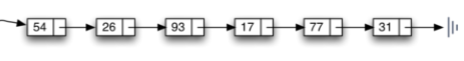

 # 链表
    顺序表的构建需要预先知道数据大小来申请连续的存储空间，
    而在进行扩充时又需要进行数据的搬迁，所以使用起来并不是很灵活。
    链表结构可以充分利用计算机内存空间，实现灵活的内存动态管理。
## 链表的定义
    链表（Linked list）是一种常见的基础数据结构，是一种线性表，但是不像顺序表一样连续存储数据，而是在每一个节点（数据存储单元）里存放下一个节点的位置信息（即地址）。


## 单向链表
    单向链表也叫单链表，是链表中最简单的一种形式，它的每个节点包含两个域，一个信息域（元素域）和一个链接域。这个链接指向链表中的下一个节点，而最后一个节点的链接域则指向一个空值。
 
- 表元素域elem用来存放具体的数据。
- 链接域next用来存放下一个节点的位置（python中的标识）
- 变量p指向链表的头节点（首节点）的位置，从p出发能找到表中的任意节点。
### 单链表的操作
- is_empty() 链表是否为空
- length() 链表长度
- travel() 遍历整个链表
- add(item) 链表头部添加元素
- append(item) 链表尾部添加元素
- insert(pos, item) 指定位置添加元素
- remove(item) 删除节点
- search(item) 查找节点是否存在
### 代码实现单向链表
```python
class SingleNode(object):
    """单链表的节点"""

    def __init__(self, item):
        # _item存放数据元素
        self.item = item
        # _next是下一个节点的标识
        self.next = None


class SingleLinkList(object):

    def __init__(self):
        self._head = None

    # 判断链表是否为空
    def is_empty(self):
        return self._head == None

    # 判断链表的长度
    def length(self):
        cur = self._head
        count = 0
        while cur != None:
            count += 1
            cur = cur.next
        return cur

    # 遍历链表
    def travel(self):
        cur = self._head
        while cur != None:
            yield cur
            cur = cur.next

    # 链表头部添加元素
    def add(self, item):
        node = SingleNode(item)
        node.next = self._head
        self._head = node

    # 链表尾部添加元素
    def append(self, item):
        node = SingleNode(item)
        if self.is_empty():
            self._head = node
        else:
            cur = self._head
            while cur.next != None:
                cur = cur.next
            cur.next = node

    # 指定位置添加元素
    def insert(self, pos, item):
        node = SingleNode(item)
        if pos <= 0:
            self.add(item)
        elif pos >= self.length():
            self.append(item)
        else:
            count = 0
            pre = self._head
            while count < pos - 1:
                count += 1
                pre = pre.next
            node.next = pre.next
            pre.next = node

    # 删除节点
    def remove(self, item):
        # 游标，用于指向需要删除的节点
        cur = self._head
        # 游标， 用于指向需要删除的节点的shang
        pre = None
        # 循环知道需要删除的节点位置
        while cur != None:
            # 如果是要删除的节点则pre的next指向cur的next则删除
            if cur.item == item:
                # 如果要删除的是第一个节点则直接把头指向cur.ne
                if not pre:
                    self._head = cur.next
                else:
                    pre.next = cur.next
            else:
                pre = cur
                cur = cur.next

    #     查找节点是否存在
    def search(self, item):
        cur = self._head
        while cur != None:
            if cur.item == item:
                return True
            cur = cur.next
        return False

```
## 双向链表
```python
class Node(object):
    """节点"""

    def __init__(self, item):
        self.item = item
        self.prev = None
        self.next = None


class DLinkList(object):
    """双向链表"""

    def __init__(self):
        self._head = None

    # 判断链表是否为空
    def is_empty(self):
        return self._head is None

    # 链表的长度
    def lenght(self):
        count = 0
        cur = self._head
        while cur != None:
            count += 1
            cur = cur.next
        return count

    # 遍历链表
    def travel(self):
        cur = self._head
        while cur is not None:
            yield cur.item
            cur = cur.next

    # 链表头部插入元素
    def add(self, item):
        node = Node(item)
        if self.is_empty():
            self._head = node
        else:
            node.next = self._head
            self._head.prev = node
            self._head = node

    # 链表尾部添加元素
    def append(self, item):
        node = Node(item)
        cur = self._head
        while cur.next is not None:
            cur = cur.next
        cur.next = node
        node.prev = cur

    # 链表指定位置添加元素
    def insert(self, pos, item):
        if pos <= 0:
            self.add(item)
        elif pos >= self.lenght():
            self.append(item)
        else:
            node = Node(item)
            count = 0
            cur = self._head
            while count != pos - 1:
                cur = cur.next
                count += 1
            node.next = cur.next
            cur.next.prev = node
            cur.next = node
            node.prev = node

    #  删除节点
    def remove(self, item):
        if self.is_empty():
            return
        cur = self._head
        if cur.item == item:
            if cur.next is None:
                self._head = None
                return item
            else:
                self._head = self._head.next
                self._head.prev = None
                return item
        while cur is not None:
            if cur.item == item:
                cur.next.prev = cur.prev
                cur.prev.next = cur.next
                return item
            cur = cur.next

    # 查找节点是否存在
    def search(self, item):
        cur = self._head
        while cur is not None:
            if cur.item == item:
                return True
            cur = cur.next
        return False
```
## 单向循环链表
```python
class Node(object):
    """节点"""

    def __init__(self, item):
        self.item = item
        self.next = None


class SinCycLinkedlist(object):

    def __init__(self):
        self.__head = None

    # 判断链表是否为空
    def is_empty(self):
        return self.__head is None

    # 返回链表的元素个数
    def lenght(self):
        if self.is_empty():
            return 0
        cur = self.__head
        count = 0

        while cur.next is not self.__head:
            count += 1
            cur = cur.next

        return count

    # 遍历
    def travel(self):
        cur = self.__head
        if cur is not None:
            while cur.next is not self.__head:
                yield cur.item
                cur = cur.next

    # 在头部添加一个节点
    def add(self, item):
        node = Node(item)
        if not self.__head:
            self.__head = node
            return item
        node.next = self.__head
        cur = self.__head
        while cur.next is not self.__head:
            cur = cur.next
        cur.next = node
        self.__head = node
        return item

    # 在尾部添加一个节点
    def append(self, item):
        node = Node(item)
        if not self.__head:
            self.__head = node
            return item
        cur = self.__head
        while cur.next is not self.__head:
            cur = cur.next
        cur.next = node
        node.next = self.__head

    # insert(pos, item) 在指定位置pos添加节点
    def insert(self, pos, item):
        if pos <= 0:
            self.add(item)
            return item
        elif pos >= self.lenght():
            self.append(item)
            return item
        else:
            node = Node(item)
            count = 0
            cur = self.__head
            while count < pos-1:
                cur = cur.next
            node.next = cur.next
            cur.next = node

    # remove(item) 删除一个节点
    def remove(self, item):
        if not self.__head:
            return
        cur = self.__head
        pre = None
        while cur.item != item and cur.next is not self.__head:
            pre = cur
            cur = cur.next
        if cur.item == item:
            pre.next = cur.next
            return item
        else:
            return False

    # search(item) 查找节点是否存在
    def search(self, item):
        cur = self.__head
        while cur and cur.next is not self.__head:
            cur = cur.next
            if cur.item == item:
                return True
        else:
            return False

```
