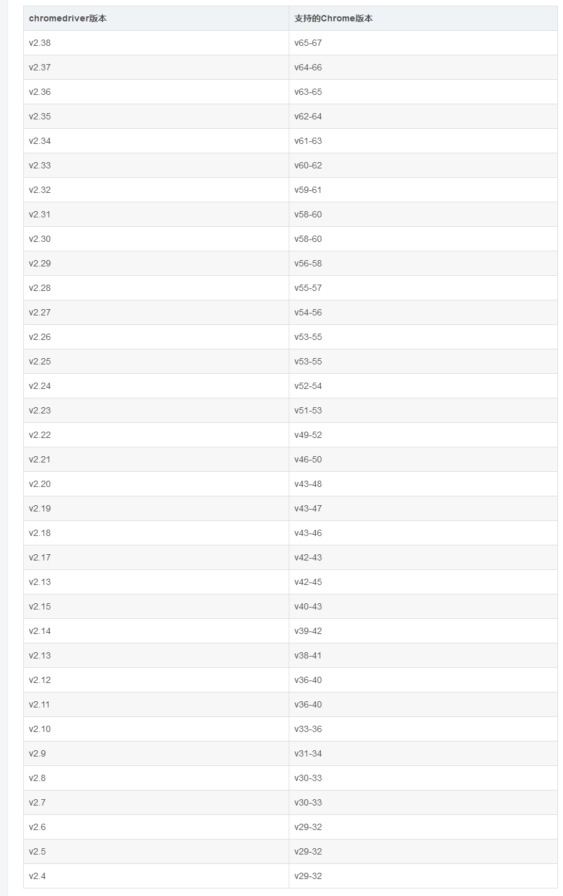

# Selenium
    
Selenium是一个Web的自动化测试工具，最初是为网站自动化测试而开发的，类型像我们玩游戏用的按键精灵，可以按指定的命令自动操作，不同是Selenium 可以直接运行在浏览器上，它支持所有主流的浏览器

Selenium 可以根据我们的指令，让浏览器自动加载页面，获取需要的数据，甚至页面截屏，或者判断网站上某些动作是否发生。

Selenium 自己不带浏览器，不支持浏览器的功能，它需要与第三方浏览器结合在一起才能使用
## 驱动浏览器的webdriver
    Selenium需要浏览器对应的webdriver才能驱动浏览器
### 谷歌浏览器

对于chrome浏览器，有时候会有闪退的情况，有时候也许是版本冲突的问题，我们要对照着这个表来对照查看是不是webdriver和chrome版本不对应


下载地址：http://chromedriver.storage.googleapis.com/index.html
### phantomjs
    PhantomJS 是一个基于Webkit的“无界面”(headless)浏览器，
    它会把网站加载到内存并执行页面上的 JavaScript，因为不会展示图形界面，
    所以运行起来比完整的浏览器要高效。
    
下载地址 : http://phantomjs.org/download.html

# Selenium基本使用

## 安装
```pip install selenium```
## 入门实例
```python
from selenium import webdriver

# 初始化一个Chromedriver用来驱动 Chrome
driver = webdriver.Chrome(executable_path=r'E:\SDE\webdriver\chromedriver2.38.exe')

# 请求网页
driver.get(url='https://www.baidu.com/')

# 通过 page_source获取网页代码
print(driver.page_source)

# 关闭当前页面
driver.close()
# 退出整个浏览器
driver.quit()
```
## 定位元素
>- find_element： 用来查找第一个匹配上的单个元素
>- find_elements : 用来查找所有匹配上的元素
 
1. find_element_by_id: 根据ID来查找元素
```
element = driver.find_element_by_id("coolestWidgetEvah")
------------------------ or -------------------------
from selenium.webdriver.common.by import By
element = driver.find_element(by=By.ID, value="coolestWidgetEvah")
```
2. find_elements_by_class_name: 根据class属性来查找元素
```
cheeses = driver.find_element_by_class_name("cheese")
------------------------ or -------------------------
from selenium.webdriver.common.by import By
cheeses = driver.find_element(By.CLASS_NAME, "cheese")
```
3. find_element_by_name : 根据name属性来查找元素
```
cheese = driver.find_element_by_name("cheese")
------------------------ or -------------------------
from selenium.webdriver.common.by import By
cheese = driver.find_element(By.NAME, "cheese")
```
4. find_element_by_tag_name: 根据标签名称来查找元素
```
cheese = driver.find_element_by_name("cheese")
------------------------ or -------------------------
from selenium.webdriver.common.by import By
cheese = driver.find_element(By.NAME, "cheese")
```
5. find_element_by_css_selector: 根据css选择器来选择元素
```
cheese = driver.find_element_by_css_selector("#food span.dairy.aged")
------------------------ or -------------------------
from selenium.webdriver.common.by import By
cheese = driver.find_element(By.CSS_SELECTOR, "#food span.dairy.aged")
```
6. find_elements_by_xpath: 根据xpath语法获取元素
```
inputs = driver.find_element_by_xpath("//input")
------------------------ or -------------------------
from selenium.webdriver.common.by import By
inputs = driver.find_element(By.XPATH, "//input")
```
7. find_element_by_link_text: 根据a标签的文本信息查找
```
cheese = driver.find_element_by_link_text("cheese")
------------------------ or -------------------------
from selenium.webdriver.common.by import By
cheese = driver.find_element(By.LINK_TEXT, "cheese")
```
8. find_element_by_partial_link_text: 根据a标签中部分文本查找
```
cheese = driver.find_element_by_partial_link_text("cheese")
------------------------ or -------------------------
from selenium.webdriver.common.by import By
cheese = driver.find_element(By.PARTIAL_LINK_TEXT, "cheese")
```
### 配置Charm为无界面浏览器
```
from selenium import webdriver
from selenium.webdriver.chrome.options import Options

chrome_options = Options()
chrome_options.add_argument('--headless')
chrome_options.add_argument('--disable-gpu')

# 初始化一个PhantomJSdriver用来驱动 PhantomJS
driver = webdriver.Chrome(executable_path=r'E:\SDE\webdriver\chromedriver2.38.exe', chrome_options=chrome_options)
```
